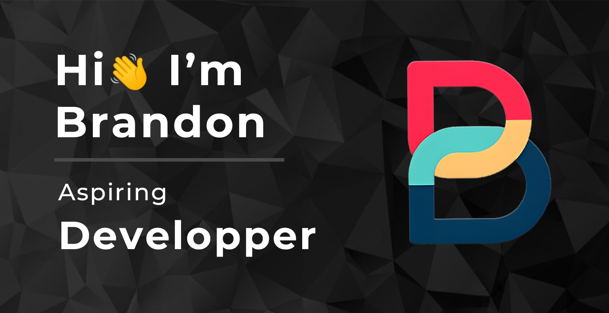
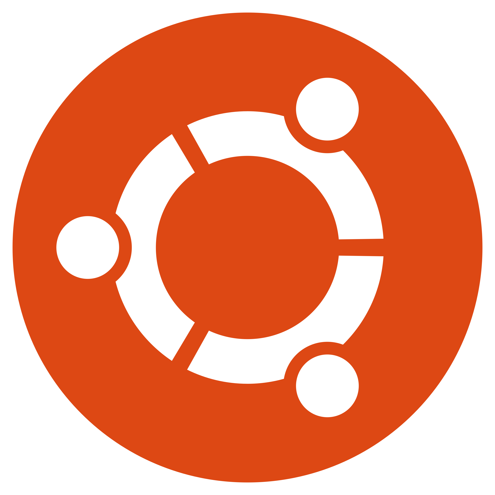

    

<h2 align="center">Hi, I'm a passionate French developer from Vietnam 💕</h2>

Currently studying in my first year of MMI, I'm diving into the world of programming and web development!

<h3 align="center">Technologies & Tools I’m Exploring:</h3>

<ul style="list-style-type:none; text-align:center; font-size: 18px;">
    <li><b>💻 Mastering C++ for software development</b></li>
    <li><b>🌱 Learning web development (HTML, CSS, JavaScript)</b></li>
    <li><b>🐧 Ubuntu is my OS of choice for development, though I occasionally switch to Windows for simplicity</b></li>
    <li><b>🎨 I love the Dracula theme for its cool, dark aesthetic while coding</b></li>
</ul>

<h3 align="center">Tools I Use:</h3>

    
    
    
    
    

<h3 align="center">A Little More About Me:</h3>

<ul style="list-style-type:none; text-align:center; font-size: 18px;">
    <li><b>🎶 I’m passionate about music! My favorite artist is <a href="https://open.spotify.com/intl-fr/artist/1Xyo4u8uXC1ZmMpatF05PJ?si=Nl9oYTozQ_Cs0Fk3gymT3Q" target="_blank">The Weeknd</a>, but I also enjoy <a href="https://open.spotify.com/intl-fr/artist/3TVXtAsR1Inumwj472S9r4?si=4Ac25Uy5Ra2xpArH_gimFw" target="_blank">Drake</a>.</b></li>
    <li><b>💖 My favorite music genre is US Pop</b></li>
    <li><b>🎮 Fun fact: I love video games in my free time</b></li>
</ul>

<h3 align="center">My Projects:</h3>

    <a href="https://github.com/ton-compte/projet1" target="_blank">
        <button style="padding: 10px 20px; font-size: 16px; margin: 5px; background-color: #4CAF50; color: white; border: none; border-radius: 5px;">
             Project 1
        </button>
    </a>
    <a href="https://github.com/ton-compte/projet2" target="_blank">
        <button style="padding: 10px 20px; font-size: 16px; margin: 5px; background-color: #2196F3; color: white; border: none; border-radius: 5px;">
             Project 2
        </button>
    </a>
    <!-- Ajoute plus de projets de la même manière -->

<h3 align="center">Let's Connect!</h3>

Feel free to reach out to me or explore my repositories. I’m always open to collaboration and learning new things!

